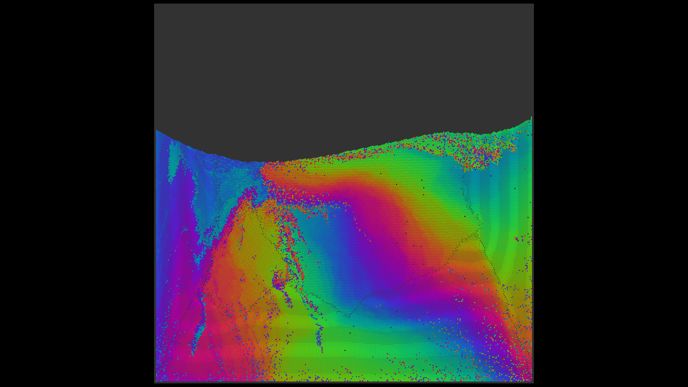

# Verlet Multi thread



## À propos de ce projet
Ce simulateur a été modifié et adapté par **Clément Desodt** (ENS Paris-Saclay, Département Génie Civil et Environnement) pour des applications spécifiques d'interaction sol-mur de soutènement (modélisation de poussée/butée, adaptation de la physique, système de sauvegarde/chargement des états, etc.).

## Remerciements / Crédits
Ce projet est basé sur le code original [VerletSFML-Multithread](https://github.com/johnBuffer/VerletSFML-Multithread) développé par John Buffer (Jean Tampon). 
Le code original est distribué sous la [licence MIT](LICENSE), qui autorise la modification et la redistribution sous réserve d'inclure la notice de copyright d'origine. Les modifications apportées par Clément Desodt sont également distribuées sous la même licence MIT.

## Compilation

[SFML](https://www.sfml-dev.org/) and [CMake](https://cmake.org/) need to be installed.

Create a `build` directory

```bash
mkdir build
cd build
```

**Configure** and **build** the project

```bash
cmake ..
cmake --build .
```

On **Windows** it will build in **debug** by default. To build in release you need to use this command

```bash
cmake --build . --config Release
```

You will also need to add the `res` directory and the SFML dlls in the Release or Debug directory for the executable to run.

