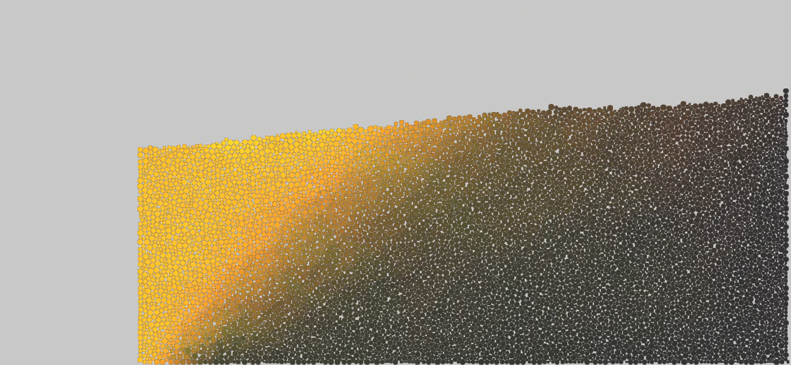

# Verlet Multi thread



## À propos de ce projet
Ce simulateur a été modifié et adapté pour des applications spécifiques d'interaction sol-mur de soutènement (modélisation de poussée/butée, adaptation de la physique, système de sauvegarde/chargement des états, etc.). 

- Clément Desodt (ENS Paris-Saclay, Département Génie Civil et Environnement) -

## Remerciements / Crédits
Ce projet est basé sur le code original [VerletSFML-Multithread](https://github.com/johnBuffer/VerletSFML-Multithread) développé par John Buffer (Jean Tampon). 
Le code original est distribué sous la [licence MIT](LICENSE), qui autorise la modification et la redistribution sous réserve d'inclure la notice de copyright d'origine. Les modifications apportées par sont également distribuées sous la même licence MIT.

## Compilation

Ce projet utilise [CMake](https://cmake.org/) et gère automatiquement ses dépendances (comme [SFML](https://www.sfml-dev.org/)).

### 1. Générer et compiler le projet

Créez un dossier `build` à la racine du projet et lancez la configuration et la compilation :

```bash
mkdir -p build
cd build
cmake ..
make -j$(nproc)
```

*(Sur **Windows**, le projet compile en Debug par défaut. Pour compiler en Release, utilisez plutôt `cmake --build . --config Release`. Notez qu'il faudra peut-être copier le dossier `res` et les DLLs de la SFML à côté de l'exécutable).*

### 2. Exécuter les simulations

La compilation génère deux exécutables distincts dans le sous-dossier `build/bin/` :

- **Simulation de Fondation (Poinçonnement)** :
  Lancez-la via la commande suivante depuis la racine du projet :
  ```bash
  ./build/bin/VerletFoundation
  ```

- **Simulation de Mur (Mur de soutènement, Butée/Poussée)** :
  Lancez-la via la commande suivante depuis la racine du projet :
  ```bash
  ./build/bin/VerletWall
  ```

> **Note :** 
> - La touche `Espace` permet de pauser/reprendre l'émission (qui est automatisée jusqu'au remplissage complet par défaut).
> - Les paramètres physiques (frottement, dilatance, géométrie, etc.) peuvent être facilement ajustés dans la section `CONFIGURATION GENERALE` située tout en haut des fichiers `src/app_foundation.cpp` et `src/app_wall.cpp`. N'oubliez pas de relancer un `make` dans le dossier `build` après chaque modification !
> - **Réinitialisation de l'empilement :** Le programme sauvegarde l'état stabilisé des grains dans des fichiers `.bin` (`foundation_state.bin` ou `base_state.bin`) à la racine pour accélérer les démarrages suivants. Si vous souhaitez refaire l'émission des particules à zéro (ex: suite à un changement du nombre de particules ou de leurs rayons), vous devez simplement supprimer ces fichiers `.bin`.
